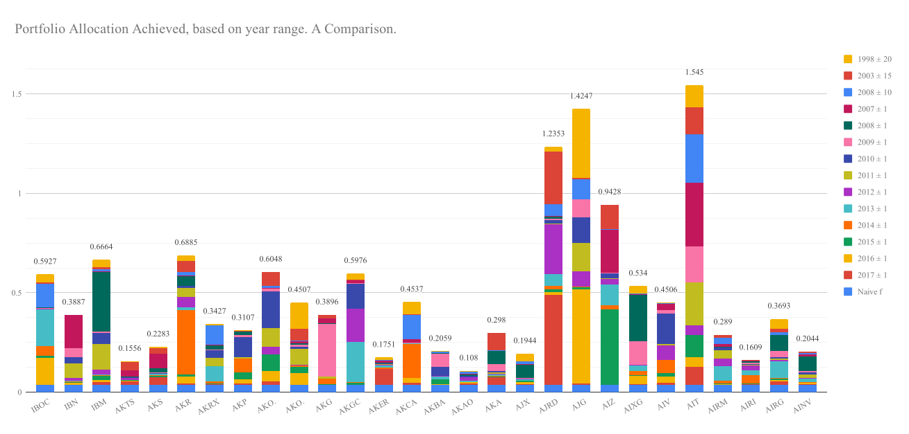

# Results

### Global Details:

Field                  | Value
-----------------------|-------
Number of Stocks       | 28
Naive f                | 1 / 28 = 0.0357...
Population of Genomes  | 500
Elite Population       | 5
Mutation Chance        | 0.1
Crossover Chance       | 0.5
Scale of gene mutation | 0.0001
Genetic Time Allowed   | 60s

# TODO

Explain table ^

## Performance of the Algorithm vs control results

Year Range  | # Correlations | # Data Points | Naive Gain         | Genetic Gain | UK Interest Gain 
------------|----------------|---------------|--------------------|--------------|-----------------
2017 ± 1    | 351            | 182           | 1.199026           | 1.805432     | 1.015068
2016 ± 1    | 378            | 206           | 1.422137           | 2.240821     | 1.012550
2015 ± 1    | 325            | 202           | 1.111099           | 1.511684     | 1.012550
2014 ± 1    | 300            | 200           | 0.853343           | 1.271068     | 1.015075
2013 ± 1    | 300            | 188           | 1.119157           | 1.767346     | 1.015075
2012 ± 1    | 231            | 176           | 1.380570           | 2.144387     | 1.015075
2011 ± 1    | 231            | 176           | 1.164945           | 1.631635     | 1.015075
2010 ± 1    | 231            | 176           | 1.179257           | 1.575081     | 1.020125
2009 ± 1    | 231            | 176           | 1.577015           | 2.127189     | 1.055144
2008 ± 1    | 231            | 173           | 0.916735           | 1.221756     | 1.107639
2007 ± 1    | 210            | 161           | 0.751403           | 0.979822     | 1.150135
2008 ± 10   | 378            | 1009          | 1.830986           | 3.605183     | 1.789870
2003 ± 15   | 378            | 1372          | 2.406743           | 4.211454     | 4.154327
1998 ± 20   | 378            | 1632          | 2.374645           | 5.203981     | 12.312127

### How to read this table:

1. The year range is 2 key values, the first value being the year on which the data is centered.
And the second value being the number of years either side of the first value which data is
taken from. I.e. another way to read 2017 ± 1 is all the data in the range 2016 - 2018.

2. The Number of correlations: is the number of calculated values between stocks. So if a stock
has no data for that year range then it will not have any correlations with any other stocks.
But if it does than we calculate its correlation with every other stock with data in it.

3. The Number of data points: is the number of data points from all stocks in that year
range.

4. Gain: the return as a percentage, if one were to invest a portfolio into the stocks
at the start of the time range. And sell all stocks at the end of the time range.
So a gain of 1.1, over the range 2017 ± 1, means we if started with £100 in 2016, then
we would end up with £100 * 1.1 if we sold all in 2018. So a gain > 1 is profit, and
a gain < 1 is a loss.
  * Naive Gain: is the gain if we distributed our portfolio exactly evenly over all the
  stocks.
  * Genetic Gain: is the gain if we distributed our portfolio according to the results
  of the genetic algorithm at the end of its 60s evolution time.
  * UK Interest Gain: is the gain if you had a bank giving you interest at the
  defined level according to the Bank of England, over the same time period. ![[Bank of England]](https://www.bankofengland.co.uk/boeapps/database/Bank-Rate.asp)

### Plotted as a graph:

## Performance on Individual Stocks:

Stock | Naive f | 2017 ± 1 | 2016 ± 1 | 2015 ± 1 | 2014 ± 1 | 2013 ± 1 | 2012 ± 1 | 2011 ± 1 | 2010 ± 1 | 2009 ± 1 | 2008 ± 1 | 2007 ± 1 | 2008 ± 10 | 2003 ± 15 | 1998 ± 20
------|---------|----------|----------|----------|----------|----------|----------|----------|----------|----------|----------|----------|----------|----------|---
IBOC   | 0.0357 | 0.0023 | 0.1338 | 0.0102 | 0.0503 | 0.1856 | 0.0009 | 0.0005 | 0.0019 | 0.0016 | 0.0045 | 0.0001 | 0.1189 | 0.0063 | 0.0401
IBN    | 0.0357 | 0.0008 | 0.0125 | 0.0006 | 0.0033 | 0.0036 | 0.0154 | 0.0740 | 0.0312 | 0.0429 | 0.0014 | 0.1658 | 0.0005 | 0.0002 | 0.0008
IBM    | 0.0357 | 0.0134 | 0.0116 | 0.0231 | 0.0022 | 0.0045 | 0.0244 | 0.1261 | 0.0569 | 0.0059 | 0.3012 | 0.0037 | 0.0105 | 0.0101 | 0.0371
AKTS   | 0.0357 | 0.0178 | 0.0032 | 0.0046 | 0.0004 | 0.0007 | 0.0105 | 0.0002 | 0.0004 | 0.0029 | 0.0006 | 0.0336 | 0.0001 | 0.0399 | 0.0050
AKS    | 0.0357 | 0.0378 | 0.0019 | 0.0050 | 0.0064 | 0.0055 | 0.0005 | 0.0006 | 0.0021 | 0.0036 | 0.0202 | 0.0725 | 0.0005 | 0.0299 | 0.0061
AKR    | 0.0357 | 0.0067 | 0.0358 | 0.0109 | 0.3226 | 0.0135 | 0.0528 | 0.0468 | 0.0090 | 0.0018 | 0.0471 | 0.0051 | 0.0153 | 0.0560 | 0.0294
AKRX   | 0.0357 | 0.0043 | 0.0002 | 0.0043 | 0.0106 | 0.0745 | 0.0019 | 0.0400 | 0.0404 | 0.0021 | 0.0221 | 0.0037 | 0.0969 | 0.0006 | 0.0054
AKP    | 0.0357 | 0.0098 | 0.0199 | 0.0343 | 0.0677 | 0.0019 | 0.0001 | 0.0053 | 0.1008 | 0.0126 | 0.0163 | 0.0002 | 0.0006 | 0.0043 | 0.0012
AKO.B  | 0.0357 | 0.0191 | 0.0503 | 0.0858 | 0.0002 | 0.0000 | 0.0362 | 0.0956 | 0.1836 | 0.0126 | 0.0004 | 0.0041 | 0.0115 | 0.0686 | 0.0011
AKO.A  | 0.0357 | 0.0005 | 0.0588 | 0.0309 | 0.0092 | 0.0001 | 0.0022 | 0.0797 | 0.0119 | 0.0081 | 0.0082 | 0.0120 | 0.0013 | 0.0597 | 0.1324
AKG    | 0.0357 | 0.0024 | 0.0001 | 0.0023 | 0.0286 | 0.0005 | 0.0002 | 0.0082 | 0.0010 | 0.2642 | 0.0033 | 0.0237 | 0.0019 | 0.0165 | 0.0010
AKGC   | 0.0357 | 0.0003 | 0.0022 | 0.0077 | 0.0056 | 0.2022 | 0.1665 | 0.0007 | 0.1230 | 0.0043 | 0.0000 | 0.0132 | 0.0014 | 0.0043 | 0.0305
AKER   | 0.0357 | 0.0808 | 0.0003 | 0.0002 | 0.0065 | 0.0092 | 0.0044 | 0.0058 | 0.0003 | 0.0003 | 0.0034 | 0.0123 | 0.0022 | 0.0023 | 0.0114
AKCA   | 0.0357 | 0.0121 | 0.0250 | 0.0003 | 0.1698 | 0.0021 | 0.0003 | 0.0018 | 0.0002 | 0.0006 | 0.0004 | 0.0196 | 0.1223 | 0.0017 | 0.0618
AKBA   | 0.0357 | 0.0003 | 0.0044 | 0.0228 | 0.0002 | 0.0139 | 0.0040 | 0.0009 | 0.0462 | 0.0667 | 0.0012 | 0.0003 | 0.0087 | 0.0002 | 0.0004
AKAO   | 0.0357 | 0.0080 | 0.0064 | 0.0004 | 0.0000 | 0.0058 | 0.0178 | 0.0015 | 0.0062 | 0.0006 | 0.0075 | 0.0042 | 0.0104 | 0.0002 | 0.0033
AKAM   | 0.0357 | 0.0394 | 0.0003 | 0.0028 | 0.0056 | 0.0052 | 0.0048 | 0.0064 | 0.0049 | 0.0362 | 0.0667 | 0.0007 | 0.0013 | 0.0872 | 0.0008
AJX    | 0.0357 | 0.0054 | 0.0094 | 0.0062 | 0.0018 | 0.0058 | 0.0022 | 0.0002 | 0.0015 | 0.0037 | 0.0648 | 0.0034 | 0.0165 | 0.0001 | 0.0377
AJRD   | 0.0357 | 0.4543 | 0.0133 | 0.0144 | 0.0156 | 0.0622 | 0.2497 | 0.0036 | 0.0173 | 0.0055 | 0.0107 | 0.0029 | 0.0590 | 0.2645 | 0.0266
AJG    | 0.0357 | 0.0095 | 0.4706 | 0.0111 | 0.0046 | 0.0012 | 0.0739 | 0.1450 | 0.1267 | 0.0909 | 0.0002 | 0.0001 | 0.1002 | 0.0075 | 0.3475
AIZ    | 0.0357 | 0.0012 | 0.0012 | 0.3790 | 0.0196 | 0.1057 | 0.0256 | 0.0037 | 0.0256 | 0.0031 | 0.0003 | 0.2156 | 0.0031 | 0.1215 | 0.0019
AIXG   | 0.0357 | 0.0063 | 0.0402 | 0.0050 | 0.0176 | 0.0307 | 0.0008 | 0.0031 | 0.0001 | 0.1176 | 0.2311 | 0.0064 | 0.0001 | 0.0002 | 0.0391
AIV    | 0.0357 | 0.0120 | 0.0318 | 0.0176 | 0.0640 | 0.0013 | 0.0740 | 0.0054 | 0.1537 | 0.0178 | 0.0003 | 0.0312 | 0.0025 | 0.0002 | 0.0031
AIT    | 0.0357 | 0.0915 | 0.0474 | 0.1130 | 0.0003 | 0.0005 | 0.0483 | 0.2149 | 0.0009 | 0.1797 | 0.0001 | 0.3228 | 0.2408 | 0.1384 | 0.1107
AIRM   | 0.0357 | 0.0001 | 0.0033 | 0.0041 | 0.0150 | 0.0713 | 0.0380 | 0.0437 | 0.0120 | 0.0005 | 0.0053 | 0.0141 | 0.0314 | 0.0139 | 0.0006
AIRI   | 0.0357 | 0.0048 | 0.0003 | 0.0029 | 0.0411 | 0.0240 | 0.0262 | 0.0043 | 0.0013 | 0.0092 | 0.0068 | 0.0011 | 0.0008 | 0.0020 | 0.0004
AIRG   | 0.0357 | 0.0197 | 0.0050 | 0.0088 | 0.0028 | 0.0849 | 0.0062 | 0.0050 | 0.0075 | 0.0303 | 0.0807 | 0.0023 | 0.0135 | 0.0156 | 0.0513
AINV   | 0.0357 | 0.0035 | 0.0064 | 0.0013 | 0.0041 | 0.0172 | 0.0044 | 0.0174 | 0.0085 | 0.0079 | 0.0733 | 0.0103 | 0.0064 | 0.0076 | 0.0004
N Gain | 0      | 1.1990 | 1.4221 | 1.1111 | 0.8533 | 1.1192 | 1.3806 | 1.1649 | 1.1793 | 1.5770 | 0.9167 | 0.7514 | 1.8309 | 2.4067 | 2.3746
G Gain | 0      | 1.8054 | 2.2408 | 1.5117 | 1.2711 | 1.7673 | 2.1444 | 1.6316 | 1.5751 | 2.1272 | 1.2218 | 0.9798 | 3.6052 | 4.2115 | 5.2040

