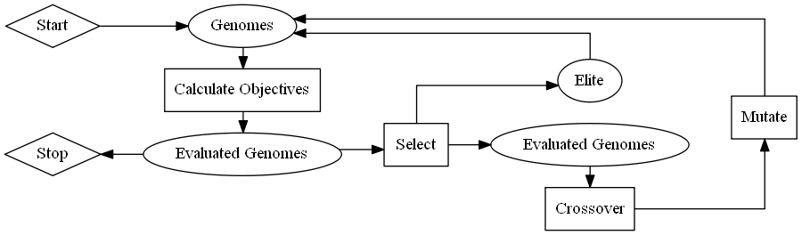
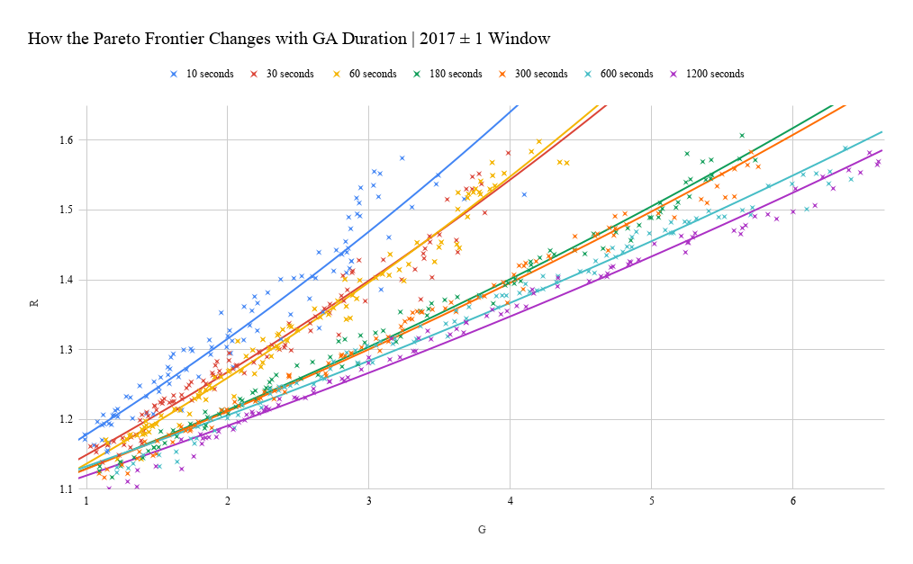
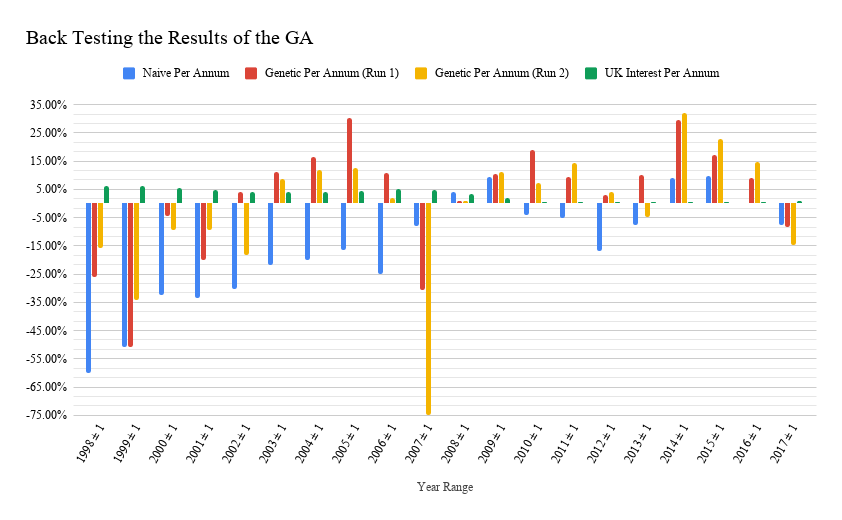
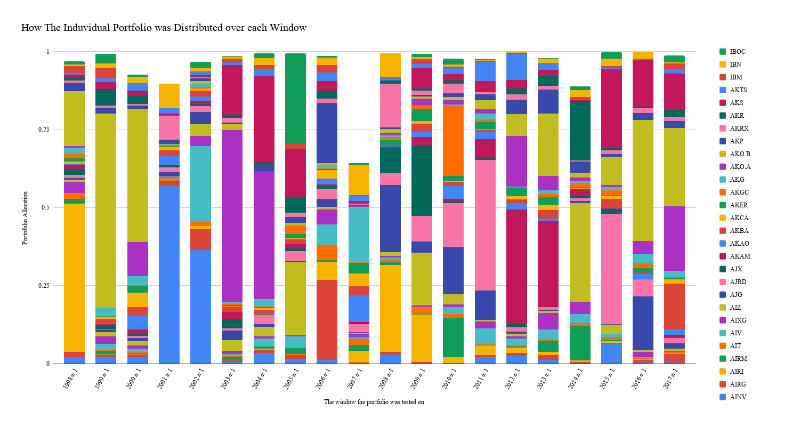
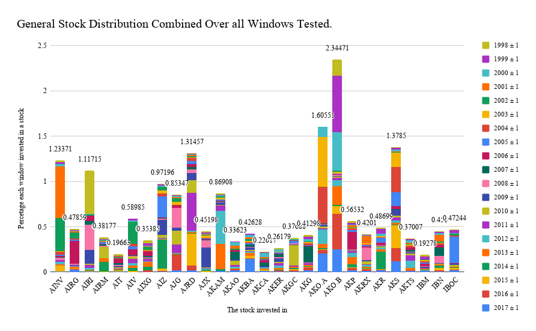
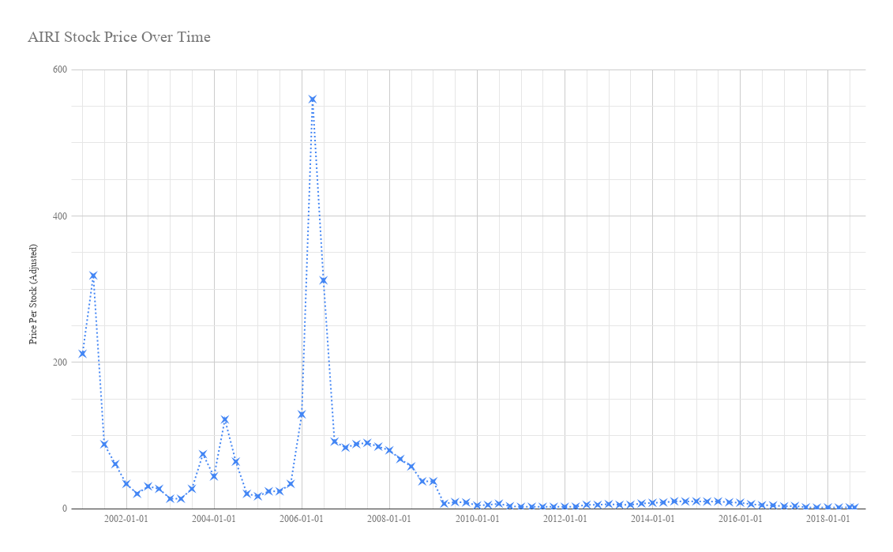

# Portfolio Optimization Using Geometric Mean, Risk Correlation & Multi-Objective Genetic Algorithms

## What?

Some Basic Terms:

* A **Portfolio** is a collection of investments in various economic assets.
* The **Optimization** of a portfolio is the process of finding the optimal
  distribution over said assets. Which results in the greatest return over time
  with the lowest risk of losing the investments.
* The **Geometric Mean** is the central tendency or typical value of a set of
  numbers by using the product of their values to indicate such a value.
* **Risk Correlation** is the concept of finding correlations between economic
  assets so that we can allocate our portfolio factoring in this correlation. This
  helps improve returns and reducing risk.
* **Multi-Objective Genetic Algorithms** are a class of genetic algorithm which
  aim to solve problems which have multiple objectives to be solved simultaneously.
  In our case the return of the portfolio is the first objective, and the risk
  of portfolio is the second objective.

## How did I go about attempting to solve it?

The biggest factor to my solution was the dataset provided by my supervisor
<sup>1</sup>. This dataset, is a collection of stocks. So we already narrowing the scope
of the portfolio to a more niche subset. Most portfolio's should be over
multiple markets, and multiple assets in those markets.
But the principle is the same. For actually optimizing a portfolio.

Once we have this set. I used Haskell to implement my solution.
This involved, csv parsing<sup>2</sup>, calculating geometric mean, risk correlation,
creating the two objectives, and finally setting up the genetic constants
to run the GAs<sup>3</sup>. The GA used was NSGA-II, this is the latest iteration
multiple-objective optimization.



For the actual experiments and collection of data I elected to go with a windowing
technique. Where we only consider data within a certain time range, and only 
use this data for the calculations. If you were to actually to use this for
portfolio optimization, then your window should obviously end at the current time.
And the size of the window is how much older data believe is still relevant for
analysis of future performance. For reference a window of 3 years was chosen
for my experiment, this was arbitrarily chosen.

## Demo!

``` sh
cd C:\Users\Lexer\Documents\Uni\FYP\axl626\Application\Portfolio
cabal run 2015 1
```

Bug in the GA library, sometimes a generation will just lock up. Temp-fix
restart the program.

## Results

### Pareto frontier



For a real tool, this would be the output, and you could choose the portfolio which aligns
with your risk level and gain amount. But in all future graphs only the highest \(G\)
was chosen. This is arbitrarily done.

After extracting the results from the program, and plotting them.
Its also worth noting that to compare how well the problem was solved. The graphs
compare a naive split of the portfolio. i.e. a complete even distribution
over the market. And the not doing anything strategy, of comparing it to
interest rates. Here we only choose the 



You can see how the GA tends to outperforms the naive implementation a majority of the time. But it does not always outperform interest rates, and for 



In this 3 minute graph we can see an anomaly in the year and 2007, in which only ~60% of
the portfolio budget was allocated. Because the solver is a GA, its hard
to know the reasons for this, since a GA is a black box. But even with this
low allocation, it still outperforms the naive distribution and interest rates at
the time.



Here we can clearly see that over all time in general the GA favours certain
stocks. Choosing one stock to analyze:

* **AIRI : Air Industries Group** is a supplier for aeroplane parts.
  Which has done the exact opposite of consistently growing.
  It had a really well priced starting period, and then just crumbled during
  the 2007 economic crisis. It also doesn't have a wikipedia article.



Looking at their stock data you can see how its currently a fairly weak stock at current
time. And furthermore had two very large spikes in performance. Interestingly enough
the stock was not publicly available to trade until the year 2000. Which means that
the 1998 run was actually investing in a stock which had a gain of 0.


### Thanks for coming - Q & A

---

<sub>1: [Shan's dataset (Requires cs.bham gitlab to access)](https://git-teaching.cs.bham.ac.uk/mod-ug-proj-2018/axl626/tree/master/Application/Data) </sub>  
<sub>2: [CSV Library used found here](http://hackage.haskell.org/package/cassava-0.5.1.0) </sub>  
<sub>3: [GA Library used found here](http://hackage.haskell.org/package/moo-1.2) </sub>