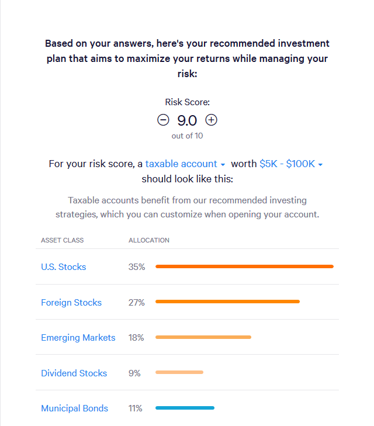

# Preliminaries

I want to create a real world useful piece of software which i can actually use to determine
which stocks would be the best investment.

Ideally it has minimal inputs, point it towards a stock market, give it a portfolio and a risk
tolerance. From there work out the best way to allocate the portfolio that is predicted to 
produce the best return.

---

I.e.

Starting Portfolio: £50,000

Asset class | Year 1  | After 3 years | Re balance
------------|---------|---------------|----------
Cash        | £5,000  | £5,125        | £5,326
Stocks      | £45,000 | £48,135       | £47,934

The ratio between cash and stocks is maintained through out (1:9), even if it involves selling
some stocks.

In reality it is more likely that they're are many more asset classes used, and the ratio 
is based more the on the overall volatility of each asset. As well as the level of acceptable 
risk and expected return.

## Existing systems

Paying a financial advisor to do the labor for you is a perfectly valid strategy. Manually
reallocating the portfolio into different market areas. But it has the problem of the human
condition will stay static and unwilling to change. For example a stock has risen in value
by 5% over the 3 years. And the overall allocation of the portfolio has now been thrown out
of balance. A human may still keep the stock, but this could lead to a greater risk, and 
less great reward.

There does exist some websites which claim to do this role. One example is https://www.wealthfront.com
which when I faux used to test it. I had a questionnaire, which asked me about the following 
topics:

* Primary reason for investing?
    * General savings
    * Retirement
    * College savings
    * Other
* What are you looking for in a financial advisor?
    * I'd like a diversified investment portfolio
    * Save money on taxes
    * I'd like someone to complete manage my investments
    * I'd like to match or beat the performance of the markets
* Whats your age?
* Whats your income
* Describe your household
    * Single income, no dependents
    * Single income, 1 or more dependents
    * Dual income, no dependents
    * Dual income, 1 or more dependents
    * Retired
* Whats your total value of your liquid investments
* What do you value more?
    * Maximizing gains
    * Minimizing losses
    * Both equally
* If your entire portfolio lost 10% of its value in a month, what would you do?
    * Sell your investments
    * Sell some
    * Keep all
    * Buy more

Once this was completed this screen was presented:

> 

This kind of system would be something I would like to create. But instead of a focus
on the allocation across assets. I would create a smaller piece of the puzzle, my software
would be ideally focused on just stocks. It would be the software that receives
27% + 35% of the portfolio, and uses that value as its input to calculate the best 
stocks to invest in.

In practice it could be used once the user has split their own portfolio into asset classes.
They take their calculated stock investment, and put it into my program with their
desired market, and use that to invest their money. 

## Feature Analysis

These are the features which are most required to make a system similar to or what already
exists.

Features:

* Inputs 
    - Portfolio
    - Risk tolerance
        * can be extrapolated from a questionnaire
        * or given as an amount the person is willing to loose from their portfolio
    - Inflation rate over time (aka current climate)
    - One or markets
        * to begin with simply start with the dataset provided by my supervisor
        * Make it capable to add new markets which are preprocessed to provide evaluation
* Outputs
    - Expected returns as a graph from the current date
    - Variance, show worst case and best case scenarios
    - Navigate the analyzed stocks to see the determined risk and reward for each stock

## Identifying Complex problems

Finding the risk of stocks should be hard:

Will do reading.