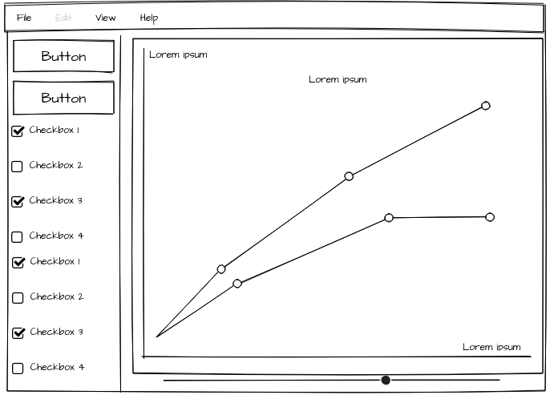
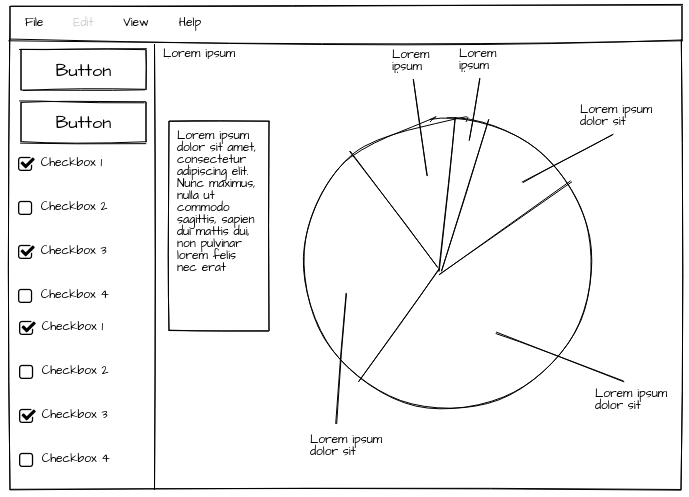
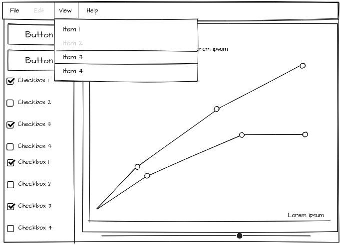

# Design

**Read Analysis.md first**

Features:

* Inputs 
    - Portfolio
    - Risk tolerance
        * can be extrapolated from a questionnaire
        * or given as an amount the person is willing to loose from their portfolio
    - Inflation rate over time (aka current climate)
    - One or markets
        * to begin with simply start with the dataset provided by my supervisor
        * Make it capable to add new markets which are preprocessed to provide evaluation
* Outputs
    - Expected returns as a graph from the current date
    - Variance, show worst case and best case scenarios
    - Navigate the analyzed stocks to see the determined risk and reward for each stock

## GUI

Mock Ups:

The UI is relatively simple, and clean. The top menu bar is for editing settings and will
have the options for inputing the market data sets, and some sort of current climate input.
The side menu will have options for the graphs as well as risk tolerance and portfolio options.

The slider along the bottom will be for time scales and how far into the future it should
predict.

Additionally the graph should be able to be hovered over and more detail given, each stock
invested in should be drawn with predicted rises and falls plotted. Potentially
on option could show all stocks even the ones not invested in. The same is true of the pie
chart, hovering for more information and showing included stocks.

---

## Deciding which technologies to use

After much deliberation I have decided, to base my design on a simple MVC pattern. An SQL based Model
controlled by some abstraction layer, acting as a server side scripting language. Which is then displayed
using a Javascript front-end displayed on a browser.

Since i have experience with Haskell i am going to use it as the back-end interface which is the layer
of abstraction on top of the SQL which the Javascript makes requests too.